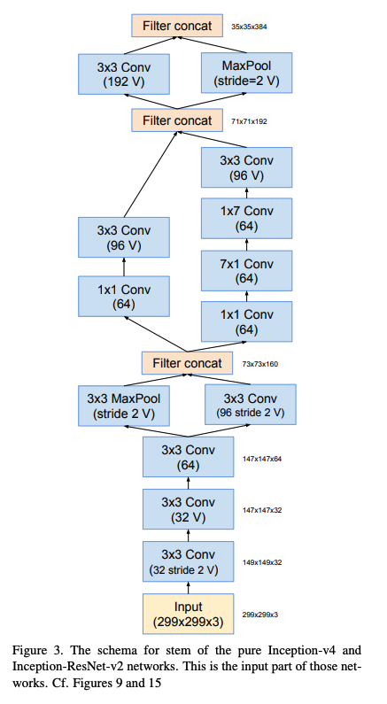

# Inception-V4

- paper - https://arxiv.org/pdf/1602.07261

- Inception-V4, Inception-ResNet 제안
    - Inception-V4 : Inception 신경밍을 좀 더 효과적으로 넓고 깊게 만들기 위해 고안. V3보다 단순하고 획일화된 구조와 더 많은 Inception module을 사용
    - Inception-ResNet : Inception V4 + residual connection → 학습 속도가 빨라짐.

### Inception-V4

---

- Inception 모둘이 6개의 종류
- 입력에서 출력으로 갈수록 더 많은 개수의 branch 사용
- 텐서의 크기가 줄어드는 Reduction을 별도로 사용
- V : 패딩을 적용하지 않은 Conv (V표기가 없다면 zero-padding 적용)
    - Inception-V4 전체 구조
        
        
        
    - Stem
        
        
        
    - Inception-A
        
        
        
    - Inception-B
        
        
        
    - Inception-C
        
        
        
    - Reduction-A
        
        
        
    - Reduction-B
        
        
        

### Inception-ResNet

---

- V1, V2 두 가지 버전
    - Inception-ResNet 구조
        
        
        
    - Stem
        
        
        
        
        
        
    - Inception-ResNet-A
        
        
        
        
        
        
    - Inception-ResNet-B
        
        
        
        
        
        
    - Inception-ResNet-C
        
        
        
        
        
        
    - Reduction-A
        
        
        
    - Reduction-B
        
        
        
        
        
        

- Filter의 수가 1000개를 초과할 때 Residual Variants가 불안정해져 학습 도중에 네트워크가 죽어버리는 문제 발생 (수만번의 Iteration이 지나면 Average Pooling 이전에 0 값만을 반환)
- 활성화 함수를 적용하기 이전에 잔차를 Scaling Down하여 학습 과정을 완화
    
    
    
- Inception과 Residual connection 결합의 의의