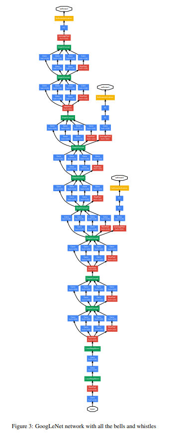

# InceptionNet (Google Net)

- Paper : https://arxiv.org/pdf/1409.4842
    
    
    

### Motivation

---

- 딥러닝 네트워크의 성능을 높이는 가장 단순한 방법은 네트워크의 크기를 키우는 것 ⇒ Depth(레이어 수)와 Width(각 레이어의 유닛 수)를 증가시키는 것. 그러나 이러한 방법에는 두 가지 주요 문제점 발생.
    - 모델의 크기가 커질수록 매개변수 수가 증가하여 과적합(Overfitting)의 위험이 커짐.
    - 연산량이 급격히 증가하여 실용적인 사용 어려움.
- 두 문제를 해결하는 근본적인 방법은 fully connected ⇒ sparsely connected architecture (convolution 내부에서도)
    - 그러나 당시의 컴퓨팅 인프라는 희소 행렬 연산에 최적화되어 있지 않으며, 따라서 연산 효율을 고려한 대안이 필요.

### Inception module

---

- 기본적인 모듈(Inception 모듈)은 여러 크기의 필터(1×1, 3×3, 5×5, pooling)를 동시에 적용하고, 이들의 출력을 결합하는 방식으로 설계 ⇒ 서로 다른 스케일의 특징을 효과적으로 학습.
    - pooling 연산은 최신 convolution network에 필수적. 각 단계에 추가.
    - Max-pooling 연산 사용 ⇒ 불필요한 특징을 줄이면서 중요한 정보를 유지
- 차원 축소 기법
    - 3x3, 5x5 연산은 레이어가 쌓일 수록 연산량이 많아진다는 문제점 발생 ⇒ 1x1 컨볼루션 사용으로 연산량 최적화
- 그림 2-b의 모듈들이 여러개 겹처있고 이따금씩 stride=2의 max-pooling도 있는 경우가 있다.
    
    
    

### **Auxiliary Classifier**

---

- GoogLeNet은 매우 깊은 구조로 인해 역전파 과정에서 발생하는 그래디언트 소실 문제 ⇒ auxiliary classifier 도입
- 정규화 효과를 제공하여 모델의 일반화 성능 향상
- 학습 시, 최종 손실 함수에 가중치를 두어 학습 과정에 반영하여 학습 안정성 향상

### Training Methodology

---

- 이미지 크기 변형
- 랜덤 크롭 및 미러링
- 색상 왜곡
- 224x224 RGB 3채널
- 22 layers (or 27 layers with count pooling)
- Average pooling layer with 5x5 filter size and stride 3
    - 4x4x512 output (4a)
    - 4x4x528 output (4d)
- 1×1 convolution with 128 filters for dimension reduction and rectified linear activation
- fully connected layer with 1024 units and rectified linear activation
- dropout layer with 0.7 ratio of outputs
- linear layer with softmax loss as the classifier (predicting the same 1000 classes as the main classifier, but removed at inference time)
- stochastic gradient descent(SDG) with 0.9 momentum
- fixed learning rate schedule (decreasing the learning rate by 4% every 8 epochs)
    
    