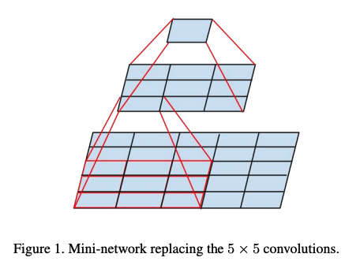

# Inception Net V2, V3

- Paper - https://arxiv.org/pdf/1512.00567

- VGGNet의 아이디어를 수용 및 확장해서 반영
    
    
    
    
    
    

- Factorization into smaller convolutions
    - 5x5 ⇒ 3x3 두번으로 Fig 4.인 기존 모듈에서 Fig 5. 와 같은 모듈로 변경
    
    
    
    
    
- Spatial Factorization into Asymmetric Convolutions
    - 3x3 ⇒ 1x3 + 3x1 으로 쪼개는 방법도 반영 (논문에서는 n=7, 7x7 ⇒ 1x7 + 7x1 제안)
    - 이 모듈은 입력되는 feature map의 size가 작을 때 효과가 좋아서 초반엔 Fig 5 모듈을 사용하고 중반에는 Fig 6 모듈 사용
        
        
        
- 추가적으로 Fig 7와 같은 모듈도 사용하여 총 세 가지 형태의 모듈을 사용
    
    
    
- Auxiliary Classifier
    - V1과 달리 1개만 사용
    - BN(Batch Normalization)을 적용하거나 Dropout 레이어를 추가하면 최종 네트워크의 main classifier 성능이 더 향상된다는 점 발견 ⇒ Aux classifier에 BN 추가
    
    
    

- Efficient Grid Size Reduction
    - Fig 9 의 왼쪽과 같이 Inception 모듈전에 pooling을 하면 representational bottleneck 발생
    - Fig 9 오른쪽처럼 Inception 모듈후에 pooling을 하면 bottleneck은 피하지만 연산량이 3배
    - ⇒ Fig 10와 같이 stride 2로 한 결과를 concat하여 연산량 절감과 bottleneck 해결
    
    
    
    
    
- Label Smoothing
    - 1,0 으로 나누는 one-hot encoding 기법 →  Label smoothing 기법 사용
    - [1, 0, 0], [0, 1, 0], [0, 0, 1] → [0.033, 0.933, 0.033] 식으로 변경

- Inception - V2
    - input size 35x35x288 → conv padded (출력 size 변하지 않음)
    - 3xInception 와 5xInception은 resolution을 줄일때만인 마지막 레이어에서 Fig 10 Reduction구조를 사용
        
        
        
    - V2에 여러 기법들을 차례로 누적 적용하고 제일 좋은 성능인 모델을 V3로 지정 (V3 = RMSProp + Label Smoothing + Factorized 7x7 + BN-auxiliary 모두 적용)
        
        
        

- Training Methodology
    - NVIDIA Kepler GPU 50개를 활용하여 병렬 학습 진행
    - Batch Size : 32
    - Epoch 수 : 100
    - SGD(momentum = 0.9) (최종적으로 RMSProp(Decay = 0.9, ϵ=1.0) 제일 좋은 성능 기록)
    - learning rate : 0.045
    - 2 epoch 마다 exponential rate : 0.94
    - Gradient Clipping (임계값 2.0**)** 적용하여 그래디언트 폭발 방지
    - 이동 평균(Exponential Moving Average) 기반 모델 평가