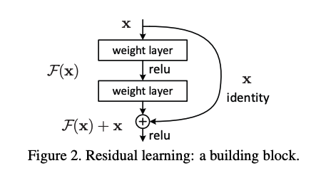

# ResNet

- Paper : https://arxiv.org/pdf/1512.03385

### Introduce

---

- 기존보다 훨씬 깊은 네트워크를 효과적으로 학습할 수 있도록 돕는 잔차 학습(Residual Learning) 프레임워크를 제안
- 일정한 깊이를 초과한 네트워크를 학습할 때 training error가 증가하는 것을 발견

### Network Architectures - Residual Network

---

- 입력과 출력 크기가 동일할 경우 - identity shortcut 적용
- 출력 차원이 증가하는 경우 - 1x1 컨볼루션을 사용하여 차원을 맞춤
- 다운샘플링하는 경우에는 stride=2인 컨볼루션을 shortcut connections(skip connection)에 적용
- identity mapping : 입력 그대로 출력하는 방법

### Skip Connection

---

- x가 들어와서 F(x)가 나가는게 기존, F(x) + x가 나가게끔 하는게 skip-connection (여기서는,  `F(x)=relu(xW1)W2`)
- skip-connection이 있을 때는 x랑 비슷한 H(x)를 만들기가 굉장히 쉽기 때문에 skip-connection을 연결해 준다는 것은 “값의 변화가 그리 크지 않은게 좋을 테니(H(x) =~ x 일 테니) block 하나에서 모든걸 다 하려고 하지 말고 조금씩만 바꿔 나가라”의미

### Residual Learning

---

- 잔차(residual)학습 - 변화량(차이)만 학습
- 한 층만 skip 해봤을 때는 성능 개선 없었다고 한다.
- BN 쓸 땐 : x→conv→bn→relu→conv→bn→+x→relu
    
    
    

### Implementation Details

---

- 입력 이미지 크기: 짧은 변을 256~480 픽셀 범위에서 랜덤하게 crop
- 평균값(mean) 제거 및 색상 변형(color augmentation) 적용
- 모든 컨볼루션 계층 뒤에 BN 적용
- SGD(확률적 경사 하강법) 최적화 기법 사용
- batch size : 256
- 초기 학습률: 0.1 (에러가 정체되면 10배 감소)
- 최대 학습 반복 횟수 : 600000
- weight decay : 0.0001
- momentum : 0.9
- dropout 미사용

### Summary

---

- Skip-connection을 추가하지 않는 plain 네트워크는 깊어질 수록 성능이 나빠지지만, skip-connection만 추가했을 뿐인데 깊어질 수록 성능이 좋아짐 (1202층까지 늘렸을 땐 overfitting 발생)
    
    
    
- skip-connection의 등장으로 모델을 엄청 깊게 만드는데 성공하여 처음으로 사람의 능력을 뛰어넘은 모델 등장
- 저자는 단순히 깊은 모델이 좋은 모델이 아니라 층마다 조금씩 값을 바꿔나가는 모델이 이상적인 네트워크라 생각하여 조금씩 값을 바꿔가면서 층을 늘렸다.
- skip-connection의 방법을 사용하여 층을 기존보다 훨씬 깊게 만든 네트워크를 사용가능