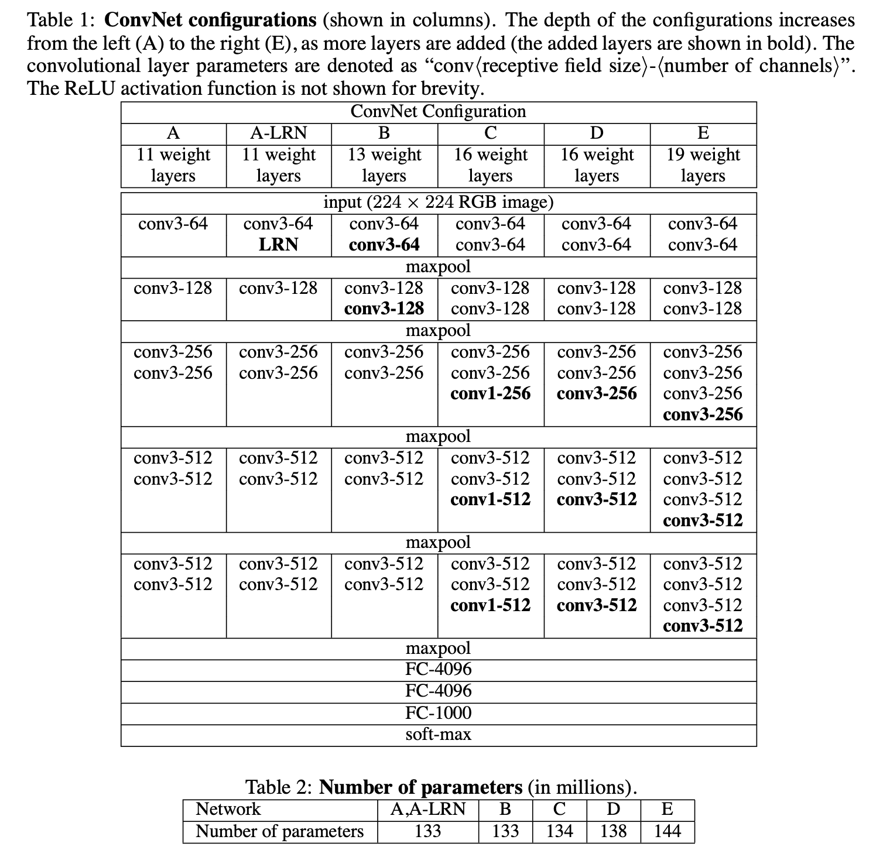

# VGG Net

### **Very Deep Convolutional Networks for Large-Scale Image Recognition**

---

- Paper : https://arxiv.org/pdf/1409.1556v6
- ResNet 전까지 다른 딥러닝  Task의 backbone으로 많이 사용.
- 3x3의 매우 작은 convolution filter를 사용하여 16 ~ 19 깊이의 weight layer로 구성
- convolution network architecture 설계에서 **깊이의 중요한 측면**을 다룸
- 3x3 사이즈의 커널을 stride = 1, padding = 1 로 이미지를 convolution 하여 이미지의 사이즈는 유지
- 다섯 개의 maxpooling으로 수행 (stride 2 사용하여 2x2 pixel 창에서 수행)
- 컨볼루션 레이어 스택은 3개의 다른  FC Layer로 이어짐. 처음 두 개는 각각 4096개의 채널을 가지고 있고, 세 번째 레이어는 1000개의 채널을 가짐 (분류 클래스의 수). 마지막 Layer는 소프트맥스 레이어.
- 모든 은닉층은 비선형 ReLU를 갖추고 있다.
- 파라미터의 수는 깊은 깊이에도 불구하고 네트워크의 weight의 수는 더 넓은 합성곱 층 너비와 수용필드를 가진 더 얕은 네트워크의  weight 수보다 많지 않다
- 첫 번째 컨볼루션 레이어에서 상대적으로 큰 필드를 사용하는 대신 3x3 필터를 스트라이드 1 과 함께 전체 네트워크에 걸쳐 사용함으로 모든픽셀에서 입력과 컨볼루션한다.
- 두 개의 3x3은 한 개의 5x5필드를 갖는것과 같은 결과를 얻는다. 단일 7x7층 대신 세 개의 3x3 컨볼루션 층을 사용함으로써 얻는 것은, 먼저, 하나의 rectification layer 대신 3 개의 rectification layer사용하여 decision 기능을 차별화한다. 둘째, 파라미터수를 줄일 수 있다. ⇒ 7x7 사용보다 3x3으로 분해하여 사용하는걸 강요
- Training
    - Optimizing multinomial logistic regression
    - Mini-batch gradient descent
    - batch size : 256
    - momentum : 0.9
    - Weight decay (L2)
    - Dropout : 0.5
    - Learning rate : 0.01

