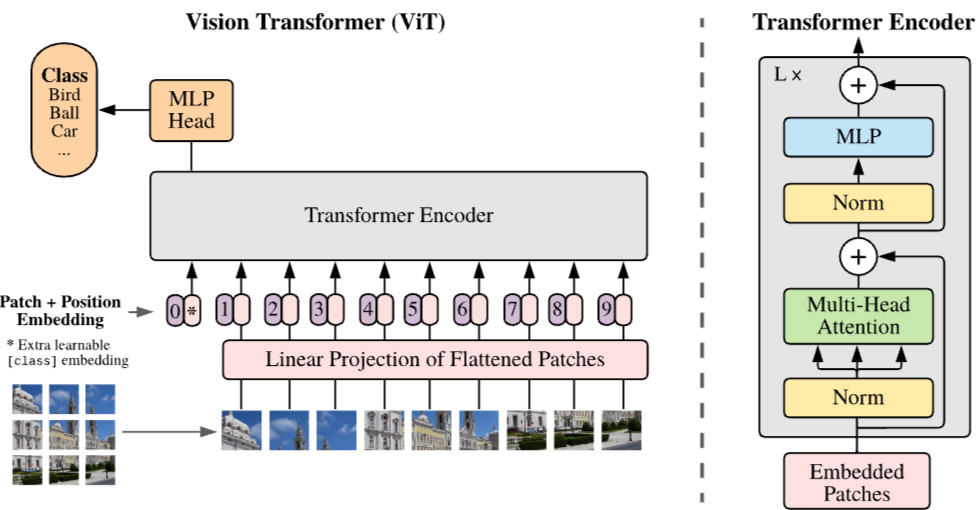

# ViT (Vision Transformer)

### Vision Transformer

---

- AN IMAGE IS WORTH 16X16 WORDS: TRANSFORMERS FOR IMAGE RECOGNITION AT SCALE (2020.08) - https://arxiv.org/pdf/2010.11929
- 이미지 인식 분야에 Transformer 아키텍처를 적용하는 연구
- CNN 기반의 기존의 방식에서 벗어나 순수한 Transformer 구조를 이미지 인식에 직접 적용한 ViT(Vision Transformer)라는 새로운 모델을 제시

### Introduction

---

- Tranformer 아키텍처는 자연어 처리(NLP)에서 표준 모델로 자리 잡았지만, 컴퓨터 비전 분야에서는 활용이 제한적
    - 기존의 시도들은 Attention을 CNN과 함께 사용하거나, CNN의 특정 구성 요소만 Transformer로 대체하는 방식
- 이미지를 패치로 분할하고, 이러한 패치의 선형 임베딩 시퀀스를 Transformer의 입력으로 제공
    - 이미지 패치는 NLP 애플리케이션의 토큰(단어)와 동일하게 취급되며, 모델은 supervised 방식으로 이미지 분류에 대해 훈련
- Transformer는 translation equivariance와 locality 같은 CNN 고유의 inductive bias이 부족
    - mid-size 데이터셋으로 일반화되게 학습이 어려움
    - 대규모 데이터셋 훈련으로 극복 (SOTA급 성능 달성)
- 논문에선 CNN에 대한 의존 없이 Transformer를 이미지 패치 시퀀스에 직접 적용하여 이미지 분류 작업에서 뛰어난 성능을 달성
- 대량의 데이터로 사전 훈련한 후 ImageNet, CIFAR-100, VTAB와 같은 이미지 인식 벤치마크에서 최첨단 CNN에 비해 더 적은 계산 자원으로도 우수한 결과

### Method

---

- 기존의 Transformer 구조를 최대한 따라감
- 입력
    - 기존의 Transformer는 1D의 토큰 임베딩의 시퀀스를 입력으로 받음
    - 이미지를 N개의 패치(PxP 사이즈)로 나눔 → $HWC = N(P^2C),\ \  (N=\frac{HW}{P^2})$
    - Transformer는 모든 layer에서 latent vector의 크기 D를 일정하게 유지하므로, patch들을 평탄화(flatten)하고 학습 가능한 linear projection을 통해 D차원으로 mapping
    - 패치 임베딩 맨 앞에 class token 추가
    - 패치 임베딩에 위치정보를 포함한 포지션 임베딩을 더한다 (학습가능한 1D 임베딩, 2D 임베딩을 사용해봤지만 논문에서는 유의미한 결과를 얻어내지 못했다고 함)
    - 이러한 결과들은 Transformer Encoder의 입력$z_0$이 된다
    - $z_0=[x_{class};x^1_pE;x^2_pE;...;x^N_pE]+E_{pos},\ \ \ \ \ \ \ \ \ E\in \mathbb{R}^{(P^2\cdot C)\times D},E_{pos}\in\mathbb{R}^{(N+1)\times D}$
- Transformer Encoder
    - Melti-head self-attention(MSA)과 MLP 블록이 번갈아 나타나는 레이어로 구성
    - Layer Normalization(LN)은 모든 블록 전에 적용
    - 모든 블록 후에 Residual-connection 적용
    - MLP는 GELU 비선형성을 갖는 두 개의 레이어로 구성

- FINE-TUNING AND HIGHER RESOLUTION
    - 일반적으로 large dataset에 사전학습, smaller dataset에 fine-tune하여 후속 작업
    - Fine-tune 작업에서 사전학습된 prediction head를 제거하고 0으로 초기화된 DxK feedforward layer를 연결 (K는 downstream task의 class 개수)
    - pre-train때보다 더 높은 해상도의 이미지를 사용하여 fine-tune 작업을 했을 때 좋은 결과물을 가져온다
    - 해상도를 높이더라도 Patch size 유지 → 더 긴 유효 시퀀스 길이 생성
    - 사전 학습된 positional embedding은 더 이상 의미가 없을 수 있다. 따라서 원본 이미지에서의 위치에 따라 사전 학습된 positional embedding을 2D interpolation하여 조정
    - 이러한 해상도 조정과 patch 추출은 이미지의 2D 구조에 대한 inductive bias를 Vision Transformer에 수동으로 주입하는 유일한 부분

### Experiments

---

- 모델 평가
    - ResNet, Vision Transformer (ViT), 그리고 하이브리드 모델의 representation learning 능력을 평가
- 데이터 요구 사항
    - 각 모델의 데이터 요구 사항을 이해하기 위해 다양한 크기의 데이터셋으로 사전 훈련을 진행하고, 여러 벤치마크 task에서 평가
- ViT의 장점
    - 모델의 사전 훈련에 필요한 계산 비용을 고려할 때, ViT는 더 적은 비용으로 대부분의 recognition 벤치마크에서 최첨단 성능을 달성하여 매우 유리
- Setup
    - Dataset
        - 모델의 확장성(scalability)을 탐색하기 위해 다양한 크기의 데이터셋을 사용
        - ILSVRC-2012 ImageNet: 1,000개의 클래스와 130만 개의 이미지를 포함
        - ImageNet-21k: 21,000개의 클래스와 1,400만 개의 이미지를 포함하는 ImageNet의 상위 집합
        - JFT: 18,000개의 클래스와 3억 3백만 개의 고해상도 이미지를 포함
    - Model Variants
        - Base, Large, Huge + patch size로 표기 (ViT-L/16)
        - Transformer의 sequence 길이는 패치 크기의 제곱에 반비례하므로 패치 크기가 작을수록 모델의 계산 비용이 더 많이 발생
        - CNN의 경우 ResNet을 사용하지만 Batch Normalization layer를 Group Normalization으로 대체하고 표준화된 convolution을 사용 → 전이 학습을 개선하며 수정된 모델을 ResNet (BiT)로 표시
        - 하이브리드의 경우 중간 특징 맵을 패치 크기가 1pixel인 ViT에 공급
        
        
        
    - Training & Fine-tuning
        - ResNet을 포함한 모든 모델을 Adam을 사용하여 학습
        - $\beta1=0.9, \beta2=0.999$
        - Batch size : 4096
        - Weight decay : 0.1
        - Linear learning rate warmup & decay
        - Fine-tune : SGD with momentum, 512 batch size
    
    
    
- COMPARISON TO SOTA
    - 가장 큰 모델인 ViT-H/14와 ViT-L/16을 기존 CNN과 비교
    - 비교 대상은 Big Transfer (BiT) 대규모 ResNet을 사용하여 지도 전이 학습을 수행
    - Noisy Student (Xie et al., 2020)로, ImageNet과 JFT-300M에서 레이블이 제거된 상태로 준지도 학습을 통해 훈련된 대규모 EfficientNet
    - 더 작은 ViT-L/16 모델은 JFT-300M에서 사전 훈련되어 모든 작업에서 BiT-L(동일한 데이터 세트에서 사전 훈련됨)보다 성능이 뛰어나며, 훈련하는 데 필요한 컴퓨팅 자원이 훨씬 적다. 더 큰 모델인 ViT-H/14는 특히 ImageNet, CIFAR-100 및 VTAB suite와 같이 더 어려운 데이터 세트에서 성능을 더욱 향상
    
    
    
- PRE-TRAINING DATA REQUIREMENTS
    - BiT CNN은 ImageNet에서 ViT보다 성능이 뛰어나지만, 더 큰 데이터 세트에서는 ViT가 능가
        
        
        
    - 합성곱 귀납적 편향이 더 작은 데이터셋에 유용하지만 더 큰 데이터셋의 경우 데이터에서 직접 관련된 패턴을 학습하는 것이 충분하고 유익하기까지 하다는 직관을 강화
        
        
        
- SCALING STUDY
    - JFT-300M으로부터의 전이 학습 성능을 평가하여 다양한 모델의 통제된 확장 연구를 수행
    - 각 모델의 사전 훈련 비용 대비 성능을 평가
    - 7개의 ResNet, $R50x1, R50x2, R101x1, R152x1, R152x2$는 7 epochs 동안 사전 훈련되었고,  $R152x2, R200x3$는 14 epochs 동안 사전 훈련되었습니다. 6개의 Vision Transformer, ViT-B/32, B/16, L/32, L/16은 7 epochs 동안 사전 훈련되었고, L/16과 H/14는 14 epochs 동안 사전 훈련되었습니다; 그리고 5개의 하이브리드, R50+ViT-B/32, B/16, L/32, L/16은 7 epochs 동안 사전 훈련되었고, R50+ViT-L/16은 14 epochs 동안 사전 훈련되었습니다 (하이브리드의 경우, 모델 이름 끝의 숫자는 patch 크기가 아니라 ResNet backbone의 총 다운샘플링 비율을 나타냅니다).
    - Vision Transformer가 성능/연산량 trade-off에서 ResNet보다 우세
    - 하이브리드는 작은 연산 예산에서 ViT보다 약간 우수하지만, 모델이 클수록 차이가 사라집니다
    - Vision Transformer는 시도된 범위 내에서 포화되지 않는 것으로 보이며, 이는 향후 확장 노력을 자극
        
        
        
- INSPECTING VISION TRANSFORMER
    - Vision Transformer의 첫 번째 레이어는 평탄화된 패치를 더 낮은 차원의 공간으로 선형적으로 투영
    - 투영 후, 학습된 위치 임베딩이 패치 표현에 추가
    
    
    
    